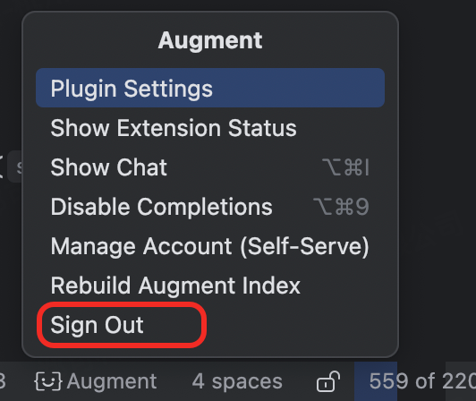

# free-augment-in-idea
free-augment-in-idea 

## 第一步： 退出你登录Augment 账号 

## 第二步： 退出IDEA (重要)

## 第三步：打开idea 插件位置 

### MAC 
`/Users/XXXXX(用户名)/Library/Application Support/JetBrains/IntelliJIdeaXXXX(版本号)/plugins/intellij-augment\lib`
- 注意替换  `XXXXX(用户名)` 和  `IntelliJIdeaXXXX(版本号)` 

### Windows 

`C:\Users\XXXXX(用户名)\AppData\Local\JetBrains\IntelliJIdeaXXXX(版本号)\plugins\intellij-augment\lib`
- 注意替换  `XXXXX(用户名)` 和  `IntelliJIdeaXXXX(版本号)` 

### 第四步：替换jar包

覆盖替换下载的 `intellij-augment-0.212.3.jar` 包 

### 第五步：重启IDEA() 

之后就可以安装正常的新注册流程进行登录使用了